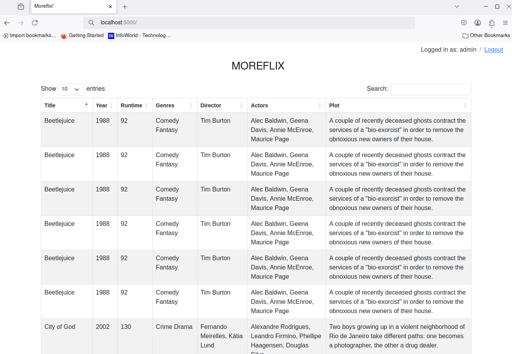
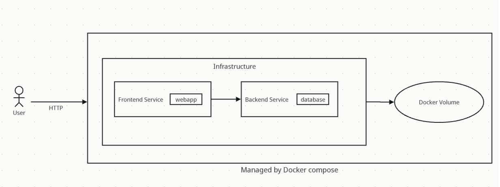

# Moreflix

## Introduction

This containerized web application displays a list of movies stored in MongoDB. This project implements a CI/CD continuous delivery pipeline using Jenkins and shared-libraries, and integrates well with multi-branch pipeline jobs.

Below is a screenshot of the application. It's pretty simple...



Below is a diagram of the application. Basically the application is deployed as services that are linked together through a docker network. Storage is persisted using a docker volume.



Python and specifically Flask is used to implement the application.

The Jenkinsfile uses a shared library, which you can find at https://github.com/tarof429/moreflix-shared-lib.

# Development

While developing this application, it can be helpful to only bring up mongo and mongo-express. To do this:

1. Comment out the moreflix service in docker-compose.yml

2. Start the services using docker compose.

```sh
COMPOSE_PROFILES=db docker compose up -d
```

Next, bring up the application.

1. Create the virtual environment.

```sh
python3 -m venv moreflix-venv
```

2. Activate the virtual environment

```sh
. ./moreflix-venv/bin/activate
```

3. Install dependencies. This needs to be done only once, or if dependencies change.

```sh
python3 -m pip install -r requirements.txt
```

4. Start the application.

```sh
. ./moreflix-venv/bin/activate
export MONGODB_USER=root
export MONGODB_PASSWORD=secret
export MONGODB_SERVER=localhost
export MONGODB_PORT=27017
flask --app moreflix run --debug
```

5. To bring down the services

```sh
COMPOSE_PROFILES=db docker compose down
```

6. Type Ctrl-X in the window running moreflix to shut it down.

## Running the application (production)

In this environment, moreflix will be brought up as a service. Take care that your shell environment does not override any environment variables defined in the .env file.

1. Start a new terminal window.

2. Build the moreflix image.

```sh
docker build -t tarof429/moreflix:latest .
```

3. If the moreflix service was commented out in docker-compose.yml, uncomment it.

4. Bring up all 3 services in the docker-compose file:

```sh
COMPOSE_PROFILES=db,app docker compose up -d
```

## Using the application

1. Point your browser to http://localhost:5000

2. To drop the database

```sh
curl http://localhost:5000/api/v1/dropdb
```

3. To populate the database

```sh
curl http://localhost:5000/api/v1/createdb
```

## Testing

First build the docker container with the integration tests. Compared to the regular Dockerfile, this Dockerfile does NOT include pycurl.

```sh
docker build -t moreflix-test -f Dockerfile-test .
```

Next start the profiles except for the tests.

```sh
COMPOSE_PROFILES=db,app docker compose up -d
```

Run the tests.

```sh
docker compose run test
```

Stop the containers.

```sh
COMPOSE_PROFILES=db,app docker compose down
```

## Todo

- The shared library function `updateVersion()` has AI generated code which I augmented to account for a small bug. I chose it because 1) it works and 2) it has some error handling. The code is fairly complex and it might be nice to come up with something simpler. 
- It might be nice to roll the two Dockerfiles into one. This design decision arose because pytest and pycurl, which are used by the tests, are not installed in the production container. 