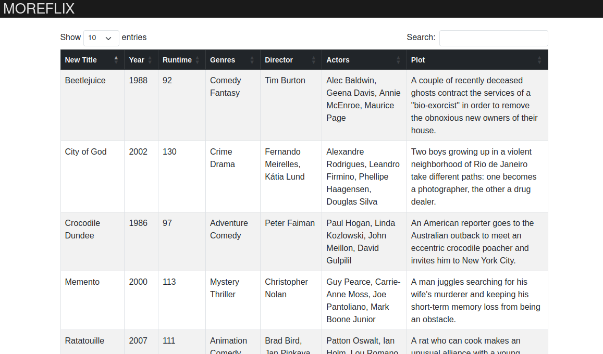

# moreflix example

## Introduction

This containerized web application displays a list of movies stored in MongoDB.



## Build instructions

While developing this application, it can be helpful to only bring up mongo and mongo-express. To do this:

1. Comment out the moreflix service in docker-compose.yml


2. Create the virtual environment.

```sh
python3 -m venv moreflix-venv
```

3. Activate the virtual environment

```sh
. ./moreflix-venv/bin/activate
```

3. Install dependencies

```sh
python3 -m pip install -r requirements.txt
```

4. Run the mongo and mongo-express containers. Hint: see the docker-compose file.

5. To run the application with flask:

```sh
. ./moreflix-venv/bin/activate
export MONGODB_USER=root
export MONGODB_PASSWORD=secret
export MONGODB_SERVER=localhost
export MONGODB_PORT=27017
flask --app moreflix run --debug
```

## Running the application (production)

With all 3 services in the docker-compose file:

1. Bring up all the containers

```sh
docker compose up
```

Be careful that you do NOT override variables define in the `.env` file. Doing so will cause connection issues that can be difficult to troubleshoot. If in doubt, SSH into the moreflix container to see what environment variables are being set.

If you want to toggle between development mode and production mode, use separate windows.

2. Populate the database (optional)

The moreflix application will automatically create the database on startup. However, you can still recreate it by issuing a curl statement.

```sh
curl http://localhost:5000/api/v1/createdb
```