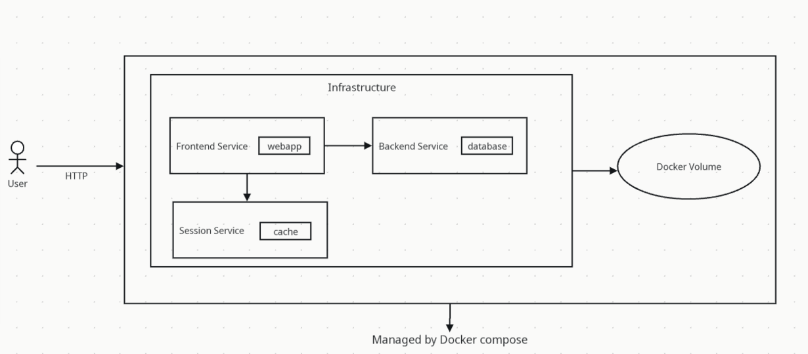

# Moreflix

## Introduction

This containerized web application displays a list of movies stored in MongoDB. This project implements a CI/CD continuous delivery pipeline using Jenkins and shared-libraries, and integrates well with multi-branch pipeline jobs.

Below is a screenshot of the application. It's pretty simple...


Below is a diagram of the application. Basically the application is deployed as services that are linked together through a docker network. Storage is persisted using a docker volume.



Python and specifically Flask is used to implement the application.

This application also supports basic authentication and session management. 

The Jenkinsfile uses a shared library, which you can find at https://github.com/tarof429/moreflix-shared-lib.

# The Story

This application started with the goal of creating something from scratch and then deploy it to AWS using CI/CD pipelines. I have some previous experience using Python and Flask. I also have experience creating containers with Docker. However this is probably the first time that I developed a CI/CD pipeline for a personal project that:

- Persists data in MongoDB
- Displays a list of items retrieved from MongoDB
- Uses Bootstrap to help style the frontend
- Uses docker-compose to orchestrate a Flask application
- Provides user authentication and session management
- Includes a Jenkins pipeline script that is able to build, test and deploy the image to a running EC2 instance

I faced challenges in implementing many of these features. I am starting to use ChatGPT to help troubleshoot things and I used ChatGPT to help figure out how to use Bootstrap for my particular scenario. Now I believe this was the right choice to help accelerate development, and that if I really wanted to master Bootstrap I would need to spend considerable time on it! 

I wanted to implement session management so that I could conditionally display the link to login and logout. This prompted a major refactoring where I implemented Blueprint to help organize the application. Also this gave me an opportunity to deploy a Redis container to persist session data, since Flask sessions store data on the server-side. With session management, you can be logged as admin from the same host even if you open multiple tabs. However, if you connect to the application from another computer, you will need to login.

Also I spent time to gain more mastery with Jenkins pipelines and especially shared libraries. In doing so, I discovered that I could use them just like Java classes:

```java
    stages {
        stage('Init') {
            steps {
                script {
                    helper = new Helper(this)
                    ...
```

This inspired me to implement a method in the shared library to enable or disable simulator mode, which is a kind of philosophy that one of my previous managers advocated. For example, in the shared library I have this code:

```java
def buildDockerImage(image, dockerfile='Dockerfile') {
    if (this.simulator) {
        // do this
    } else {
        // do that
    }
```

I really think implementing a simulator mode in Jenkins shared libraries can help cut down time spent on troubleshooting.

# Development

While developing this application, it can be helpful to only bring up backend services. To do this:

1. Start the services using docker compose.

```sh
IMAGE=dummy COMPOSE_PROFILES=db docker compose up -d
```

Next, bring up the application.

2. Create the virtual environment.

```sh
python3 -m venv moreflix-venv
```

3. Activate the virtual environment

```sh
. ./moreflix-venv/bin/activate
```

4. Install dependencies. This needs to be done only once, or if dependencies change.

```sh
python3 -m pip install -r requirements.txt
```

5. Start the application.

```sh
. ./moreflix-venv/bin/activate
export MONGODB_USER=root
export MONGODB_PASSWORD=secret
export MONGODB_SERVER=localhost
export MONGODB_PORT=27017
export REDIS_SERVER=localhost
export REDIS_PORT=6379
export FLASK_SECRET_KEY="VGhpcyBpcyBhIHZlcnkgc2VjcmV0IGtleQo"
flask --app moreflix run --debug
```

6. To bring down the services

```sh
IMAGE=dummy COMPOSE_PROFILES=db docker compose down
```

7. Type Ctrl-X in the window running moreflix to shut it down.

## Running the application (production)

In this environment, moreflix will be brought up as a service. 

1. Start a new terminal window.

Start a new shell environment so that you don't override any environment variables defined in the .env file.

2. Build the moreflix image.

```sh
docker build -t tarof429/moreflix:latest .
```

3. Bring up all 3 services in the docker-compose file:

```sh
IMAGE=tarof429/moreflix:latest COMPOSE_PROFILES=db,app docker compose up -d
```

## Using the application

1. Point your browser to http://localhost:5000. You will need to login to the application as admin/password.

2. To drop the database

```sh
curl http://localhost:5000/api/dropdb
```

3. To populate the database

```sh
curl http://localhost:5000/api/createdb
```

If the moreflix container fails to start, make sure requirements.txt is up to date before building the container.

## Testing

First build the docker container with the integration tests. Compared to the regular Dockerfile, this Dockerfile does NOT include pycurl.

```sh
docker build -t moreflix-test -f Dockerfile-test .
```

Next start the profiles except for the tests.

```sh
IMAGE=tarof429/moreflix:latest COMPOSE_PROFILES=db,app docker compose up -d
```

Run the tests.

```sh
docker compose run test
```

Stop the containers.

```sh
IMAGE=dummy COMPOSE_PROFILES=db,app docker compose down
```

## Todo

- The shared library function `updateVersion()` has AI generated code which I augmented to account for a small bug. I chose it because 1) it works and 2) it has some error handling. The code is fairly complex and it might be nice to come up with something simpler. 
- It might be nice to roll the two Dockerfiles into one. This design decision arose because pytest and pycurl, which are used by the tests, are not installed in the production container. 
- Session storage does not use docker volumes yet.